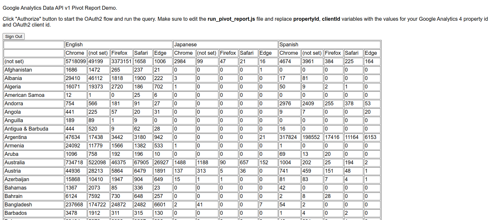

# Google Analytics Data API v1 Pivot Report demo

## Overview

This application demonstrates how to build a [pivot report](https://developers.google.com/analytics/devguides/reporting/data/v1/pivots)
using the [runPivotReport](https://developers.google.com/analytics/devguides/reporting/data/v1/rest/v1beta/properties/runPivotReport)
method of the [Google Analytics Data API v1](https://developers.google.com/analytics/devguides/reporting/data/v1)
and visualize the result using JavaScript.

The API call builds a pivot report with `country`, `language` and `browser`
pivots, displaying the number of sessions for the specified date range for each
pivot column. 

## Output example

Depending on the amount of data collected by your property within the query date
range, your pivot report will look like this:



## Running the demo

1) Edit the `run_pivot_report.js` file and replace `propertyId` variable with
   your [Google Analytics 4 property ID](https://developers.google.com/analytics/devguides/reporting/data/v1/property-id)
   before running the sample. For example:
    ```
    const propertyId = '1234567'; // YOUR GA4 PROPERTY ID
    ```

2) This demo application uses [OAuth2 flow](https://developers.google.com/identity/protocols/oauth2)
   to access data in the Google Analytics 4 property [on behalf of an end user](https://cloud.google.com/docs/authentication/end-user)
   and requires OAuth2 credentials created in your [Google Cloud project](https://cloud.google.com/resource-manager/docs/creating-managing-projects).
   
    1) Follow these [steps to create an OAuth2 Client ID](https://support.google.com/cloud/answer/6158849).
    1) Using the [Google Developers Console](https://console.developers.google.com/apis/credentials?project=_),
       edit your OAuth2 credentials to add  a JavaScript origin that corresponds to the domain where you will be
       running the demo application  (e.g. http://localhost:8080).

       **You may need to change the [publishing status](https://support.google.com/cloud/answer/10311615#publishing-status)
       of your application to "Testing" in order to be able to use HTTP urls as a
       valid JavaScript origin.**
   1) Edit the `run_pivot_report.js` file and replace `clientId` variable a
      client ID created during the previous step. For example:
    ```
    const clientId = '123456789-abcdef.apps.googleusercontent.com';
    ```
3) The easiest way to run the demo application using your local machine
   is to use [Python3](https://www.python.org/downloads/) as a simple web
   server. From the current directory, run the following command:
   ```
    python3 -m http.server 8080
   ```
   
   This will start a local web server on port `8080` serving files from the
   current  directory. You may need to change the port number if port 8080 is
   already occupied. In this case, adjust other URLs in this guide accordingly.
   
4) Open the following URL in your browser to run the demo application:
   ```
    http://localhost:8080/run_pivot_report.html
   ```

5) Click "Authorize" button to start the OAuth2 consent flow and run the query.

## Implementation

This application consists of two main components:

* `run_pivot_report.js` The JavaScript library that handles authentication,
  invokes the Google Analytics Data API v1 and draws the resulting pivot report.

* `run_pivot_report.html` The HTML file that contains the UI elements
required to run the demo and requires the `run_pivot_report.js` to run.  
  
OAuth2 flow is handled using standard [Google Single Sign-in JavaScript client methods](https://developers.google.com/identity/sign-in/web/reference).

[Google API JavaScript client](https://github.com/google/google-api-javascript-client)
is used to invoke the Google Analytics Data API v1. 
